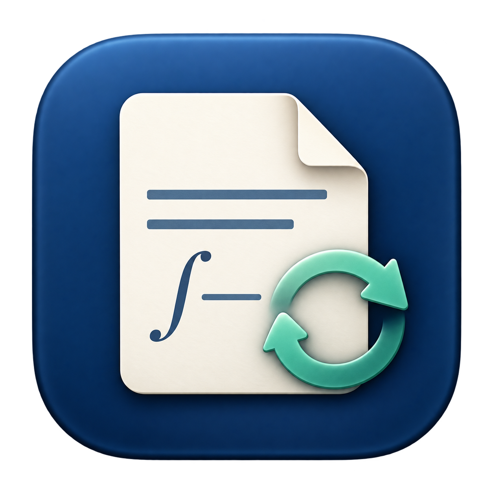

# 阅卷 · Yuyan PDF Viewer



A native macOS PDF viewer for papers that are continuously rebuilt with LaTeX. Application logic is written in **Yuyan**, compiled to **Wasm-GC**, and executed by embedded **V8**. AppKit and PDFKit provide the native interface and rendering.

## Download

[Download the latest release](https://github.com/UltimatePea/yuyan-pdf-viewer/releases/latest).

Unzip `Yuyan-PDF-Viewer-v0.1.0-macos-arm64.zip`, then open `阅卷.app` or move it to Applications.

- **Apple Silicon (arm64), macOS 26 or newer.** Intel builds are not included.
- Node/V8 and all non-system dynamic libraries are bundled. No Homebrew or Node installation is required to run the release.
- The app is ad-hoc signed, **not Apple-notarized**. macOS may require explicit approval in Privacy & Security before first launch.
- SyncTeX navigation optionally requires an installed `synctex` executable and a matching `.synctex.gz` file.

## Features

- Native continuous scrolling, page navigation, zoom, fit to width, search, text selection and printing.
- File and directory notifications detect in-place rewrites, atomic replacement and delete/recreate cycles.
- Debounced reloads retain the last valid PDF through partial writes and reject stale asynchronous results.
- Text anchors preserve the reading passage and its viewport position across page insertion/deletion, with coordinate fallback for image-only pages.
- Optional Follow Edits mode and source-to-PDF navigation through a simple CLI.

Anchoring is heuristic: extensive reflow, ambiguous text or formula-only content can fall back to the original page coordinates.

## Build and test

Development requires Xcode Command Line Tools, Node 26 headers/libraries, and a compatible Yuyan checkout. The validated [Yuyan toolchain](https://github.com/yuyan-lang/yuyan) commit is `57be1c544e1898540509c9f3c773dd57f9fc8ae6`. The matching standard-library sources are included in `第三方/标准库`.

```sh
YY_ROOT=/path/to/yuyan-wktree-1 ./构建.sh
./运行.sh /path/to/paper.pdf
./测试.sh
# Build a self-contained release ZIP:
YY_ROOT=/path/to/yuyan-wktree-1 ./发布.sh
```

Tests run the actual Yuyan Wasm-GC application with PDFKit. The integration suite also requires `latexmk` and LaTeX. A logged-in macOS graphical session is required.

```sh
# Navigate an already-open PDF after compilation:
./运行.sh --navigate /path/to/paper.pdf /path/to/source.tex 120
```

[详细说明（现代汉语）](自述.汉语.md) · [文言说明](自述.文言.md) · [Icon generation prompt](资源/图标提示词.汉语.md)

License: GPL-3.0-or-later. Bundled third-party libraries retain their own licenses, included inside the app.
